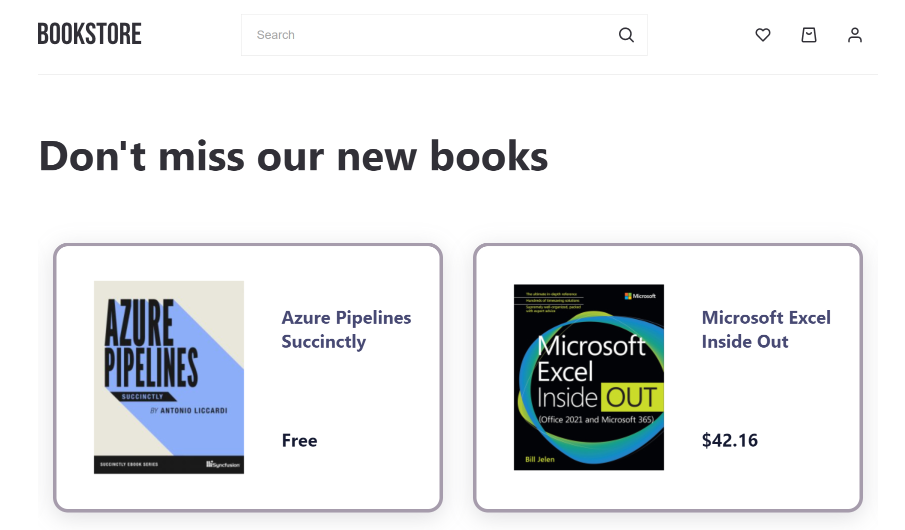

<!-- PROJECT LOGO -->
<br />
<div align="center">
    
    <p align="center">
    ·
    <a href="https://zlata-saburova.github.io/bookstore/">View Demo</a>
    · </p>
</div>

## About The Project



Bookstore is a platform for buying IT books, where you can get information about the book and see its preview.
The user has the ability to search for a book by title and add the book they like to favourites.

## Usage

Search by:

- Title
- Author
- ISNB
- Keywords

User ability:

- registration
- authorization
- reset password
- change username and email
- add or remove book from favorites list
- add books to cart and see total price

### Installation

1. Get a free API at [IT Bookstore API](https://api.itbook.store/)
2. Register on [Firebase](https://firebase.google.com/), create your data base and copy Firebase configuration
3. Clone the repo
   ```sh
   git clone https://github.com/Zlata-Saburova/bookstore.git
   ```
4. Install NPM packages
   ```sh
   npm install
   ```
5. Enter your API in `bookService`

   ```js
   private readonly API_URL = "API";
   ```

6. Enter your Firebase configuration in "firebase.js"

```js
const firebaseConfig = {" your Firebase configuration"};
```

<p align="right">(<a href="#top">back to top</a>)</p>

### Tools and packages

- [React.js](https://reactjs.org/)
- [Redux Toolkit](https://redux-toolkit.js.org/)
- [React Router](https://reactrouter.com/)
- [React Router Dom](https://www.npmjs.com/package/react-router-dom)
- [Axios](https://axios-http.com/docs/intro)
- [Styled-components](https://styled-components.com/)
- [Typescript](https://www.typescriptlang.org/)
- [React Hook Form](https://react-hook-form.com/)
- [React Outside Click Handler](https://www.npmjs.com/package/react-outside-click-handler)
- [Firebase](https://firebase.google.com/)
- [Framer Motion](https://www.framer.com/motion/)
- [React Slick](https://react-slick.neostack.com/)
- [gh-pages](https://pages.github.com/)
